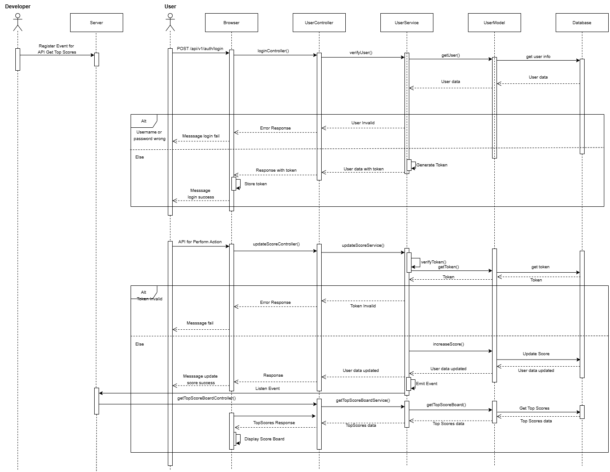

# Scoreboard API Module

## Overview
This module provides the backend API service for managing and updating user scores on the scoreboard. The scoreboard displays the top 10 user scores, which are updated in real-time as users perform actions that increase their scores.

## Features
- **User Roles and Permissions**: Manage user roles and permissions to control access to the module.
- **Live Update Score**: Real-time updates to the scoreboard to reflect the latest top 10 user scores.
- **Event-Driven**: Use events to handle user actions and update scores.
- **Security**: Authentication and authorization to prevent unauthorized score 
  
## API Endpoints

### Update Score
- **Endpoint**: `/api/v1/users/{userId}/scores`
- **Method**: `POST`
- **Description**: Update the user's score upon completing an action.
- **Request Headers**:
  - `Authorization`: A Bearer token that is used to authenticate and authorize the user making the request. This token is typically generated when the user logs in and includes information such as the user's identity and permissions. Example:
    ```json
    {
      "Authorization": "Bearer <authToken>"
    }
    ```
  - **Additional Headers (Optional)**:
    - `Content-Type`: Specifies the media type of the request body. For JSON payloads, it should be set to `application/json`.
      ```json
      {
        "Content-Type": "application/json"
      }
      ```
- **Request Body**:
  - `score`: The score value to be added to the user's current score. This should be a numeric value representing the points earned by the user. Example:
    ```json
    {
      "score": 10
    }
    ```
- **Response**:
  ```json
  {
    "status": "success",
    "message": "Score was updated successfully!",
    "data": {
        "userId": "string",
        "score": 10
    }
  }
  ```
### Get Top Scores
- **Endpoint**: `/api/v1/scoreboard`
- **Method**: `GET`
- **Description**: Retrieve the top 10 user scores.
- **Response**:
  ```json
  {
    "status": "success",
    "message": "Get top 10 user scores successfully!",
    "data": [
        {
            "userId": "string",
            "score": 10 
        }
    ]
  }
  ```
## Security
To prevent unauthorized score updates:
- **Authentication:**:
  - Ensure all API requests are authenticated using tokens (e.g., JSON Web Tokens - JWT).
  - When a user logs in, the server generates a token containing user identity and roles. This token is included in the request headers for subsequent API calls.
  - The server verifies the token's validity, expiration, and signature before processing the request.
- **Authorization:**:
  - Verify user roles and permissions before allowing score updates.
  - Implement Role-Based Access Control (RBAC) to manage roles and permissions.
  - Ensure only users with the appropriate roles can perform specific actions, such as updating scores.
- **Rate Limiting:**:
  - Implement rate limiting to prevent abuse of the API.
  - Limit the number of requests a user can make within a specific time frame to avoid spamming.

## Improvements
- **Caching**:
  - Implement caching for frequently accessed data to reduce load on the database.
  - Use in-memory data stores such as Redis or Memcached to cache the top 10 scores and other frequently requested data.
- **Event-Driven Architecture**:
  - Use events to handle user actions and update scores in real-time.
  - Emit events when a user's score is updated, and listen for these events to update the scoreboard.
- **Logging**:
  - Add logging and monitoring for API requests and responses to track suspicious activities.
  - Use logging libraries such as winston or bunyan to log important events and errors.

## WebSockets vs. Event-Driven Architecture
In this case, you can choose between using WebSockets or an event-driven architecture to handle real-time updates. Here's an analysis of both approaches:

- **WebSockets:**
  - Pros:
    - Provides a persistent connection between the client and server.
    - Enables real-time bi-directional communication.
    - Ideal for scenarios where the client needs to receive updates instantly.

  - Cons:
    - Requires more resources to maintain the open connections.
    - May be overkill if the frequency of updates is low.
    - Use Case: WebSockets are well-suited for applications where real-time updates are crucial, such as online gaming, chat applications, or stock trading platforms.

- **Event-Driven Architecture:**
  - Pros:
    - Decouples components, making the system more modular and easier to maintain.
    - Efficiently handles events and updates without the need for persistent connections.
    - Scales well with the number of events and users.

  - Cons:
    - Clients may not receive updates instantly unless combined with a mechanism like polling or long polling.

Use Case: Event-driven architecture is ideal for scenarios where updates can be processed and propagated asynchronously, such as background processing, task scheduling, or workflows.

### Recommendation:

For the scoreboard update scenario, an event-driven architecture is more suitable. It allows the backend to handle user actions, update scores, and emit events when the top 10 scores change. Clients can then fetch the latest scores periodically or upon specific triggers. This approach is more efficient and scalable for handling user scores and updating the scoreboard.

## Flow of Execution
